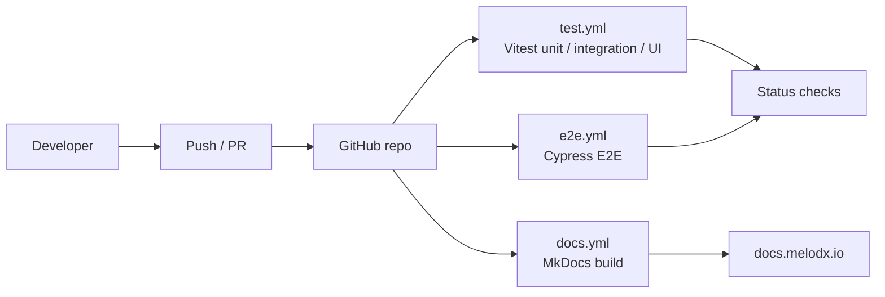

# Quality Gates

These gates apply to feature work landing on `main` for the Spotify Playlist Export case study. They are enforced by CI where possible and documented here for transparency.

## CI/CD Overview

The CI/CD pipeline runs on every push and pull request to `main` (or feature branches targeting `main`):

- `test.yml`: runs Vitest unit, integration, and UI tests.
- `e2e.yml`: runs Cypress end-to-end tests.
- `docs.yml`: builds the documentation and publishes updates.

### CI/CD pipeline diagram

## 1) CI health

- All configured workflows must succeed for the PR:
  - Vitest (unit, UI, integration)
  - Cypress E2E
  - MkDocs build
- Red builds are treated as blocking; tests should be fixed or updated with a clear rationale before merge.

## 2) Coverage gates

### Changed-files coverage

- **Target:** ≥ 75% lines and branches  
- **Definition:** Sources under `melodex-(front-end|back-end)/src/**` that differ from the baseline (or from `main` for PRs).

### Feature-scope coverage

- **Target:** ≥ 75% lines and branches  
- **Definition:** Export feature modules listed in the latest Test Execution Summary.

### Repo-wide coverage

- **Policy:** Must not decrease vs. the baseline snapshot.  
- **Notes:** Repo-wide coverage is informational for this case study; the focus is on changed-files and feature-scope coverage.

E2E coverage is intentionally not enforced. E2E validates end-to-end behavior; code coverage is measured via unit, UI, and integration layers.

## 3) Defects and security

- No open `Major`, `Critical`, or `Blocker` defects in scope at merge time.
- No `High` or `Critical` vulnerabilities in dependency scans.
- ESLint:
  - No new `High` severity issues in changed files.
  - Existing issues should not increase without justification.

## 4) Evidence

For the Spotify Playlist Export feature, the following evidence is captured and linked from the docs:

- Vitest LCOV artifact and HTML snapshot for coverage review.
- Cypress run summary and failure videos (where applicable).
- Traceability Appendix (links from requirements to tests).
- Test Execution Summary (latest run, with pass/fail status and notes).

These artifacts demonstrate that the gates were met (or that any deviations were explicitly recorded) for this case study.
