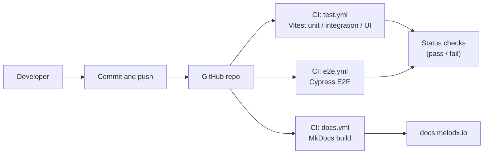

# Architecture

This feature sits across the frontend, backend, and third-party APIs. Only the components relevant to the Spotify export flow are described here.

- **Frontend:** React (`Vite`) running on AWS Amplify; renders rankings, export UI, and progress/error states.
- **Backend:** Express running on AWS Elastic Beanstalk (EC2); owns export orchestration and API routing.
- **Data:** MongoDB Atlas; stores ranked songs and user selections.
- **Auth:**
    - Cognito for Melodex user accounts.
    - Spotify OAuth for playlist permissions.
- **External services:**
    - Spotify Web API for playlist creation and track addition.
    - Deezer for metadata enrichment.
- **Media:** AWS S3 for profile images.
- **Infrastructure:** Route 53 → Amplify for frontend routing; Elastic Beanstalk for API hosting.
- **Scripts:** Helper utilities under `/scripts` for coverage processing, test orchestration, and CI support.

This architecture influenced testing decisions around:
- OAuth session persistence and revocation behavior
- Rate limiting and Retry-After handling
- Deterministic ordering in the export pipeline
- Contract stability between backend and UI

### CI/CD pipeline diagram

